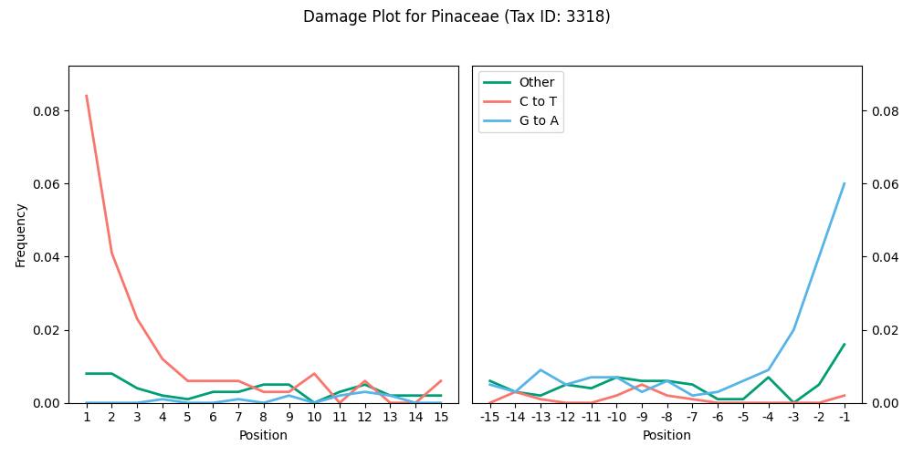
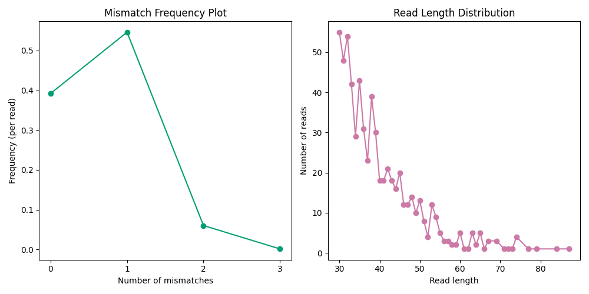

## <a name="quickstart"></a>Quick start

```
# install dependencies (tqdm is not strictly necessary)
pip install pysam hyperloglog matplotlib tqdm  

# install bamdam
git clone https://github.com/bdesanctis/bamdam.git
cd bamdam
chmod +x bamdam

# help
./bamdam -h
./bamdam shrink -h 

# run
./bamdam shrink --in_bam A.bam --in_lca A.lca --out_bam A2.bam --out_lca A2.lca --stranded ds  # (ds = double stranded library prep)
./bamdam compute --in_bam A2.bam --in_lca A2.lca --out_stats A_stats.txt --out_subs A_subs.txt --stranded ds
```

## Table of Contents
- [Quick start](#quickstart)
- [Description](#description)
- [Usage](#use)
  - [shrink](#shrink)
  - [compute](#compute)
  - [extract](#extract)
  - [plotdamage](#plotdamage)
  - [plotbaminfo](#plotbaminfo)

## <a name="description"></a>Description

Bamdam is a post-mapping toolkit for ancient environmental DNA capture or shotgun sequencing data, used after reads been mapped to a reference database and run through the least common ancestor algorithm [ngsLCA](https://github.com/miwipe/ngsLCA). The input to bamdam is a read-sorted bam (also required by ngsLCA) and the .lca file which is output by ngsLCA. 

The main two functions are bamdam **shrink** and bamdam **compute**. When mapping against large reference databases, the output bam files will often be huge and contain mostly irrelevant alignments; the reads with the most alignments are usually those assigned to uninformative taxonomic nodes (e.g. "Viridiplantae:kingdom"). Bamdam shrink produces a much smaller bam (and associated lca file) which still contains all informative alignments. Bamdam compute then takes in a (shrunken) bam and lca file and produces a large stats table with one row per taxonomic node, including authentication metrics such as postmortem damage, k-mer duplicity, and much more. Users can then set their own filtering thresholds to decide which taxa look like real ancient taxa, rather than modern environmental, lab, or database contaminants. 

There are also some accessory functions. Bamdam **extract** is a basic wrapper function that extracts reads assigned to a specific taxonomic node from a bam file into another bam file for downstream analyses. Bamdam **plotdamage** uses the subs file, a secondary output from bamdam compute, to quickly produce a postmortem damage "smiley" plot for a specified taxonomic node. Bamdam **plotbaminfo** takes a bam file as input (e.g. from bamdam extract), and plots the mismatch and read length distributions. Lastly, neither bamdam shrink nor extract remove unused reference lines from the bam header because it is not efficient to do this inside the main code, although it is a generally a good idea to do this at some point after mapping to a large database. We provide a short standalone samtools wrapper script **removeunmappedheaders** for this purpose. We recommend removing unmapped headers before running bamdam (e.g. immediately after mapping but before merging, if applicable), and potentially again after to fully minimize storage needs if needed.

Bamdam is not particularly optimized for speed, and doesn't support threading (much of the effort is spent on bam file I/O). On the other hand, it reads and writes bams line-by-line, so it shouldn't need too much RAM. Running bamdam shrink then compute with default parameters on a 20GB bam takes two hours on my laptop, and this should scale close to linearly, although it depends on how densely informative your data is (e.g. capture data may take longer than shotgun).

## <a name="use"></a>Usage

### <a name="shrink"></a>bamdam shrink

Input: Read-sorted bam file and associated lca file. Output: Smaller read-sorted bam file and associated lca file.

```
usage: bamdam shrink [-h] --in_lca IN_LCA --in_bam IN_BAM --out_lca OUT_LCA --out_bam OUT_BAM --stranded STRANDED [--options]

options:
  -h, --help            show this help message and exit
  --in_lca IN_LCA       Path to the input LCA file (required)
  --in_bam IN_BAM       Path to the input (read-sorted) BAM file (required)
  --out_lca OUT_LCA     Path to the short output LCA file (required)
  --out_bam OUT_BAM     Path to the short output BAM file (required)
  --stranded STRANDED   Either ss for single stranded or ds for double stranded (required)
  --mincount MINCOUNT   Minimum read count to keep a node (default: 5)
  --upto UPTO           Keep nodes up to and including this tax threshold; use root to disable (default: family)
  --minsim MINSIM       Minimum similarity to reference to keep an alignment (default: 0.9)
  --exclude_keywords EXCLUDE_KEYWORDS [EXCLUDE_KEYWORDS ...]
                        Keyword(s) to exclude when filtering (default: none)
  --exclude_keyword_file EXCLUDE_KEYWORD_FILE
                        File of keywords to exclude when filtering, one per line (default: none)
  --exclude_under       Do not keep nodes below criteria-meeting nodes unless they also meet criteria themselves (default: not set)
  --annotate_pmd        Annotate output bam file with PMD tags (default: not set)
```

Bamdam shrink will first subset your lca file to include only nodes which: ((are at or below your tax threshold) AND which meet your minimum read count), OR (are below a node which meets the former criteria). You can disable the last condition with --exclude_under. You may optionally give it a list OR file of tax identifiers to exclude (e.g., taxa identified in your control samples). For exclusions, you can give it tax IDs, full tax names, or full tax entries; e.g. Homonidae, "Homo sapiens", 4919, etc, but best practice is to use full tax strings like "4919:Homo sapiens:species". You can also filter the input lca file yourself beforehand, as long as the original order and format is preserved. To disable all internal filters, if you have already filtered the input lca file yourself, use 

```./bamdam shrink --mincount 0 --upto root --minsim 0```

Once the new lca file is written, bamdam shrink will subset the bam file to include only reads which appear in the newly shortened LCA file, and only alignments of those reads which meet the minimum similarity cutoff. 

Bamdam shrink will also optionally annotate the new bam file with PMD scores as in PMDTools (in the DS:Z field) (--annotate_pmd), but beware PMD score annotation can be slow for large bam files. Please note that as of the time of writing, the original PMDTools has a serious bug in single-stranded mode, so please use bamdam shrink instead if you want to annotate single-stranded data with PMD scores.

### <a name="compute"></a>bamdam compute

Input: Read-sorted bam and associated lca file. Output: Stats file and subs file.

```
usage: bamdam compute [-h] --in_bam IN_BAM --in_lca IN_LCA --out_stats OUT_STATS --out_subs OUT_SUBS --stranded STRANDED [--options]

options:
  -h, --help            show this help message and exit
  --in_bam IN_BAM       Path to the BAM file (required)
  --in_lca IN_LCA       Path to the LCA file (required)
  --out_stats OUT_STATS Path to the output stats file (required)
  --out_subs OUT_SUBS   Path to the output subs file (required)
  --stranded STRANDED   Either ss for single stranded or ds for double stranded (required)
  --kr KR               Value of k for per-read kmer complexity calculation (default: 5)
  --kn KN               Value of k for per-node counts of unique k-mers and duplicity (default: 29)
  --upto UPTO           Keep nodes up to and including this tax threshold; use root to disable (default: family)
```

An important metric for ancient environmental DNA authentication is evenness of coverage, but it is not really possible to compute evenness of coverage without resorting to a single reference genome. Instead, bamdam compute estimates the **k-mer duplicity** across all reads assigned to each taxonomic node using the fast HyperLogLog cardinality estimation algorithm, the same algorithm used to speed up [KrakenUniq](https://genomebiology.biomedcentral.com/articles/10.1186/s13059-018-1568-0). K-mer duplicity refers to the average number of times a k-mer (or its reverse complement) has been seen, and has been shown to be a reliable proxy for evenness of coverage for large values of k. Bamdam uses a value of k=29 by default and an error threshold of 1%. Unless coverage is high, k-mer duplicity should always be close to 1.

Sometimes many low complexity reads will map to the same taxa, which can warrant further investigation. Bamdam measures the average read complexity per taxonomic node via a per-read k-mer [Gini index](https://en.wikipedia.org/wiki/Gini_coefficient), which is a dispersion metric. Consider for example the low complexity read "ACCTAACCTACCTACCTACCTACCTACCTCCTACCTACCTA", which contains the 5-mer ACCTA a total of 6 times, and so yields a high Gini index of 0.46 using the default k=5. On the other hand, a Gini index of 0 indicates complete dispersion. We recommend further investigation of any taxonomic node of interest with a per-read k-mer Gini index that is substantially larger than the others in your data, especially across samples, with 0.3 as a rough suggested cutoff.

Full explanation of the output stats file columns:

- **TaxNodeID**: The tax node ID from the lca file.
- **TaxName**: The tax name from the lca file.
- **TotalReads**: The number of reads assigned to that node or underneath.
- **ND+1**: Normalized damage +1: The proportion of reads assigned to that node or underneath with a C->T on the 5' (+1) position, minus the mean (non C>T or G>A) divergence for that node.
- **ND-1**: Normalized damage -1: The proportion of reads assigned to that node or underneath with a C->T if single stranded, or a G->A if double stranded, on the 3' (-1) position, minus the mean (non C>T or G>A) divergence for that node.
- **UniqueKmers**: The number of unique k-mers in the reads assigned to that node or underneath.
- **Duplicity**: The average number of times a k-mer has been seen, where the k-mers are from reads assigned to that node or underneath.
- **MeanLength**: The mean length of the reads assigned to that node or underneath.
- **Div**: The mean divergence for that node, not including any C>T or G>A transitions.
- **ANI**: Average nucleotide identity of the reads assigned to that node or underneath. 
- **PerReadKmerGI**: Mean k-mer based Gini index, where the mean is over the reads assigned to that node or underneath. 
- **AvgGC**: Average GC content of the reads assigned to that node or underneath.
- **Damaged+1**: The actual proportion of reads assigned to that node or underneath where every alignment of that read had a C->T on the 5' (+1) position.
- **Damaged-1**: The actual proportion of reads assigned to that node or underneath where every alignment of that read had a C->T if single stranded, or a G->A if double stranded, on the 3' (-1) position.
- **TotalAlignments**: Sum of the number of alignments for all the reads assigned to that node or underneath.
- **taxpath**: The taxonomic path from the lca file.

If the input bam file was annotated with PMD scores, the stats file will also contain columns **PMDSOver2** and **PMDSOver4**, indicating the proportion of PMD scores over 2 and 4 respectively. PMD scores are from [Skoglund et al. 2014](https://doi.org/10.1073/pnas.131893411). 

In all cases unless otherwise specified, each read (not each alignment) is weighted equally.

### <a name="extract"></a>bamdam extract

A straightforward bash wrapper function to extract reads assigned to a specific taxonomic node from a bam file. Output is another bam file. Not very fast (bam i/o is slow). Accepts tax IDs (e.g. "3318") or full tax strings (e.g. "3318:Pinaceae:family").

```
./bamdam extract --in_bam A2.bam --in_lca A2.lca --keyword "3318" --out_bam A_pinaceae.bam
```

### <a name="plotdamage"></a>bamdam plotdamage

Plots a postmortem damage "smiley" plot using the subs file produced from bamdam compute. Fast.

```
./bamdam plotdamage --in_subs A_subs.txt --tax "3318" --outplot A_3318_damage_plot.png
```

Example output:
<p align="center">

</p>

### <a name="plotbaminfo"></a>bamdam plotbaminfo

Plots mismatch and read length distributions. Mostly intended to be used after bamdam extract. Not very fast for large input bam.

```
./bamdam plotbaminfo --in_bam A_pinaceae.bam --outplot A_3318_baminfo.png
```

Example output:
<p align="center">

</p>

## License
This project is licensed under the MIT License - see the LICENSE file for details.

Bamdam was written by Bianca De Sanctis in 2024. For assistance please contact bddesanctis@gmail.com.
