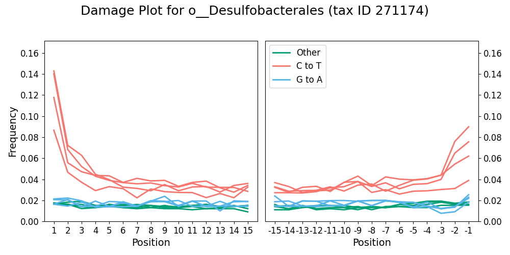
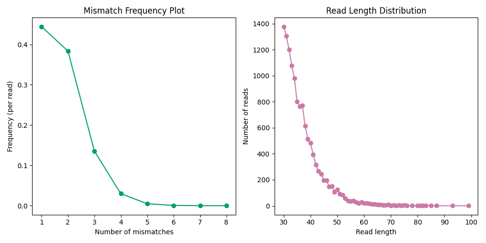

## <a name="quickstart"></a>Quick start

### Installation
- From [PyPi](https://pypi.org/project/bamdam/):
```console
pip install bamdam 
```
- From source:
```console
git clone https://github.com/bdesanctis/bamdam.git
cd bamdam
pip install .
```
### Usage

See [usage](#use) below for full documentation.

```console
# help
bamdam -h
bamdam shrink -h 

# run
bamdam shrink --in_bam A.bam --in_lca A.lca --out_bam A2.bam --out_lca A2.lca --stranded ds  # (ds = double stranded library prep)
bamdam compute --in_bam A2.bam --in_lca A2.lca --out_tsv A_tsv.txt --out_subs A_subs.txt --stranded ds
```
## Table of Contents
- [Quick start](#quickstart)
- [Description](#description)
- [Usage](#use)
  - [shrink](#shrink)
  - [compute](#compute)
  - [combine](#combine)
  - [extract](#extract)
  - [plotdamage](#plotdamage)
  - [plotbaminfo](#plotbaminfo)
  - [krona](#krona)
- [Tutorial](#tutorial)
- [Contributing](#contributing)

## <a name="description"></a>Description

Bamdam is a post-mapping, post-least-common-ancestor toolkit for managing, authenticating and visualizing ancient environmental DNA capture or shotgun sequencing data, after reads have been mapped to a reference database and run through the least common ancestor algorithm [ngsLCA](https://github.com/miwipe/ngsLCA), for example at the end of the Holi pipeline. The input to bamdam is a read-sorted bam (also required by ngsLCA) and the text file output from ngsLCA.

The first two functions are bamdam **shrink** and bamdam **compute**. When mapping against large reference databases, the output bam files will often be huge and contain mostly irrelevant alignments; the reads with the most alignments are usually those assigned to uninformative taxonomic nodes (e.g. "Viridiplantae:kingdom"). The shrink command produces a much smaller bam (and associated lca file) which still contains all informative alignments. The compute command then takes in a (shrunken) bam and lca file and produces a large table in tsv format with one row per taxonomic node, including authentication metrics such as ancient DNA damage, k-mer duplicity and mean read complexity. All datasets are different, so users can then set their own filtering thresholds to decide which taxa look like real taxa rather than contaminants.

The rest of the functions operate on the output of bamdam **shrink** and **compute**. The **extract** command extracts reads assigned to a specific taxonomic node from a bam file into another bam file for downstream analyses, optionally detecting the top reference for that node. The **plotdamage** command uses the subs file(s), a secondary output from bamdam compute, to quickly produce a postmortem damage "smiley" plot for a specified taxonomic node. The **plotbaminfo** command takes a bam file as input (e.g. from bamdam extract), and plots the mismatch and read length distributions. The **combine** command takes multiple tsv files to create a multi-sample abundance/damage/etc matrix. Lastly the **krona** command converts one or more (optionally pre-filtered) bamdam tsv files into XMLs which can be imported into [KronaTools](https://github.com/marbl/Krona) to make interactive Krona plots, in which each taxa is coloured by its 5' C-to-T misincorporation frequency, and additional information such as duplicity and mean read length per taxa is embedded. [See an example here](https://bdesanctis.github.io/bamdam/example/microbe_krona.html)  (make sure to click "Color by Damage" on the left).

Bamdam is not particularly optimized for speed, and doesn't support threading (much of the effort is spent on bam file I/O). On the other hand, it reads and writes bams line-by-line, so it shouldn't need too much RAM (usually <8GB). A 50GB shotgun sequencing bam file takes a few hours on my laptop, and this should scale roughly linearly, with higher runtimes expected for capture or highly informative data.


## <a name="use"></a>Usage

### <a name="shrink"></a>bamdam shrink

Input: Read-sorted bam file and associated lca file. Output: Smaller read-sorted bam file and associated lca file.

```
usage: bamdam shrink [-h] --in_lca IN_LCA --in_bam IN_BAM --out_lca OUT_LCA --out_bam OUT_BAM --stranded STRANDED [--options]

options:
  -h, --help            show this help message and exit
  --in_lca IN_LCA       Path to the input LCA file (required)
  --in_bam IN_BAM       Path to the input (read-sorted) BAM file (required)
  --out_lca OUT_LCA     Path to the short output LCA file (required)
  --out_bam OUT_BAM     Path to the short output BAM file (required)
  --stranded STRANDED   Either ss for single stranded or ds for double stranded (required)
  --mincount MINCOUNT   Minimum read count to keep a node (default: 5)
  --upto UPTO           Keep nodes up to and including this tax threshold; use root to disable (default: family)
  --minsim MINSIM       Minimum similarity to reference to keep an alignment (default: 0.9)
  --exclude_keywords EXCLUDE_KEYWORDS [EXCLUDE_KEYWORDS ...]
                        Keyword(s) to exclude when filtering (default: none)
  --exclude_keyword_file EXCLUDE_KEYWORD_FILE
                        File of keywords to exclude when filtering, one per line (default: none)
  --annotate_pmd        Annotate output bam file with PMD tags (default: not set)
```

Bamdam shrink will first subset your lca file to include only nodes which: ((are at or below the tax threshold) AND which meet the minimum read count), OR (are below a node which meets the former criteria), and only reads which meet the minimum similarity. You may optionally give it a list or file of numeric tax IDs, and all reads assigned to those nodes will be removed (e.g., taxa identified at some minimum threshold in your control samples). You can also filter the input lca file yourself beforehand, as long as the original order and format is preserved. For example, you may only be interested in eukaryotes, and so wish to do something like 

```grep "Eukaryot" A.lca > A_onlyeukaryots.lca```

before running bamdam shrink, which would speed it up. Once the new lca file is written, bamdam shrink will subset the bam file to include only reads which appear in the newly shortened LCA file, and only alignments of those reads which meet the minimum similarity cutoff. 

Bamdam shrink will also optionally annotate the new bam file with PMD scores as in PMDTools (in the DS:Z field) (--annotate_pmd), but PMD score annotation will roughly double the amount of time this command takes. PMD scores are from [Skoglund et al. 2014](https://doi.org/10.1073/pnas.131893411). 

Input bam files must be sorted by read order (samtools sort -n). Merging read-sorted bam files will lose the sort order, even though the resulting bam file will still claim to be read-sorted in its header, leading to a silent ngsLCA error and incorrect bamdam results. To avoid this, please read-sort bam files immediately before ngsLCA.

### <a name="compute"></a>bamdam compute

Input: Read-sorted bam and associated lca file (both from bamdam shrink output). Output: Tsv file and subs file.

```
usage: bamdam compute [-h] --in_bam IN_BAM --in_lca IN_LCA --out_tsv OUT_TSV --out_subs OUT_SUBS --stranded STRANDED [--options]

options:
  -h, --help            show this help message and exit
  --in_bam IN_BAM       Path to the BAM file (required)
  --in_lca IN_LCA       Path to the LCA file (required)
  --out_tsv OUT_TSV Path to the output tsv file (required)
  --out_subs OUT_SUBS   Path to the output subs file (required)
  --stranded STRANDED   Either ss for single stranded or ds for double stranded (required)
  --k K                 Value of k for per-node counts of unique k-mers and duplicity (default: 29)
  --upto UPTO           Keep nodes up to and including this tax threshold (default: family)
```

Full list of the output tsv columns:

- **TaxNodeID**: The tax node ID from the lca file.
- **TaxName**: The tax name from the lca file.
- **TotalReads**: The number of reads assigned to that node or underneath.
- **Duplicity**: The average number of times a k-mer has been seen, where the k-mers are from reads assigned to that node or underneath. Should be close to 1 (equivalent to no duplicated k-mers) unless coverage is high or breadth of coverage is uneven.
- **MeanDust**: The average DUST score for reads assigned to that node or underneath. This is a measure of read set complexity based on trinucleotide counts which ranges from 0 to 100, where 100 is the least complex, and below 7 is roughly "high complexity".
- **Damage+1**: The proportion of reads assigned to that node or underneath where every alignment of that read had a C->T on the 5' (+1) position. 
- **Damage-1**: The proportion of reads assigned to that node or underneath where every alignment of that read had a C->T if single stranded, or a G->A if double stranded, on the 3' (-1) position.
- **MeanLength**: The mean length of the reads assigned to that node or underneath.
- **ANI**: Average nucleotide identity of the reads assigned to that node or underneath. 
- **AvgReadGC**: Average GC content of the reads assigned to that node or underneath.
- **AvgRefGC**: Average GC content of the reconstructed reference genomic intervals associated to reads assigned to that node or underneath.
- **UniqueKmers**: The number of unique k-mers in the reads assigned to that node or underneath.
- **RatioDupKmers**: Another way of thinking about duplicity: 1 minus the ratio of unique k-mers divided by the number of total k-mers. Should be close to 0 (equivalent to no duplicated k-mers) unless coverage is high or breadth of coverage is uneven.
- **TotalAlignments**: Sum of the number of alignments for all the reads assigned to that node or underneath.
- **taxpath**: The full taxonomic path from the lca file.

If the input bam file was annotated with PMD scores, the tsv file will also contain columns **PMDSOver2** and **PMDSOver4**, indicating the proportion of PMD scores over 2 and 4 respectively.

In all cases unless otherwise specified, each read (not each alignment) is weighted equally.

Bamdam compute aggregates statistics up the taxonomy and outputs rows for all taxonomic nodes up to the "upto" flag, so perhaps counterintuitively, results from bamdam compute after excluding higher-level taxonomic nodes in bamdam shrink may still contain rows for those nodes if there were reads assigned to nodes underneath those excluded which were not themselves excluded. We suggest considering --upto "phylum" for microbes.

### <a name="combine"></a>bamdam combine

Takes in multiple tsv files from the output of bamdam compute, and combines them into one matrix. Output will always contain a total reads column, and by default will also include per-sample damage (on the 5' +1 position), the read-weighted damage mean over all samples per taxa, and the duplicity and dust per-sample. By default, only includes taxa with more than 50 total reads across samples. 

```
usage: bamdam combine --in_tsv_list TSVLIST --out_tsv OUTTSV

optional arguments:
  -h, --help            show this help message and exit
  --in_tsv IN_TSV [IN_TSV ...]
                        List of input tsv files.
  --in_tsv_list IN_TSV_LIST
                        Path to a text file containing paths to input tsv files, one per line.
  --out_tsv OUT_TSV     Path to output tsv file name (default: combined.tsv)
  --minreads MINREADS   Minimum reads across samples to include taxa (default: 50).
  --include [{damage,duplicity,dust,taxpath,all,none} ...]
                        Additional metrics to include in output file. Specify any combination of the first
                        four, 'all', or 'none'. (default: all)
```

### <a name="extract"></a>bamdam extract

Extracts reads assigned to a specific taxonomic node or underneath from a bam file. Output is another bam file. Accepts tax IDs or full tax strings. Subsetting the header is recommended to minimize output file size but it is slower, so not set by default. If subsetting the header, you can also choose to only include alignments to the most-hit reference genome to obtain a single-reference-genome bam. 

```
usage: bamdam extract --in_bam IN_BAM --in_lca IN_LCA --out_bam OUT_BAM --keyword KEYWORD [--subset_header] [--only_top_ref]

options:
  -h, --help         show this help message and exit
  --in_bam IN_BAM    Path to the BAM file (required)
  --in_lca IN_LCA    Path to the LCA file (required)
  --out_bam OUT_BAM  Path to the filtered BAM file (required)
  --keyword KEYWORD  Keyword or phrase to filter for, e.g. a taxonomic node ID (required)
  --subset_header    Subset the header to only relevant references (default: not set)
  --only_top_ref     Only keep alignments to the most-hit reference (default: not set)
```

### <a name="plotdamage"></a>bamdam plotdamage

Plots a postmortem damage "smiley" plot using the subs file produced from bamdam compute. Can take one or more subs files. Fast. Accepts numeric tax IDs only (e.g. "9606"). Produces png or pdf depending on output file suffix.

```
usage: bamdam plotdamage --in_subs SUBS --tax TAXID --outplot damageplot.png

optional arguments:
  -h, --help            show this help message and exit
  --in_subs IN_SUBS [IN_SUBS ...]
                        Input subs file(s)
  --in_subs_list IN_SUBS_LIST
                        Path to a text file contaning input subs files, one per line
  --tax TAX             Taxonomic node ID (required)
  --outplot OUTPLOT     Filename for the output plot, ending in .png or .pdf (default: damage_plot.png)
  --ymax YMAX           Maximum for y axis (optional)
```

Example output for multiple input files:
<p align="center">


### <a name="plotbaminfo"></a>bamdam plotbaminfo

Plots mismatch and read length distributions. Mostly intended to be used after bamdam extract. Not very fast for large input bam(s). Produces png or pdf.

```
usage: bamdam plotbaminfo [-h] (--in_bam IN_BAM [IN_BAM ...] | --in_bam_list IN_BAM_LIST) [--outplot OUTPLOT]

optional arguments:
  -h, --help            show this help message and exit
  --in_bam IN_BAM [IN_BAM ...]
                        Input bam file(s)
  --in_bam_list IN_BAM_LIST
                        Path to a text file containing input bams, one per line
  --outplot OUTPLOT     Filename for the output plot, ending in .png or .pdf (default: baminfo_plot.png)
```

Example output for one input file:
<p align="center">

</p>

### <a name="krona"></a>bamdam krona

Converts one or more tsv files (from bamdam compute) to an XML file which can be passed to [KronaTools](https://github.com/marbl/Krona)'s ktImportXML function to produce multi-sample, damage-coloured Krona html files. Output is annotated with 5' damage, dust, duplicity and mean read length for each taxa for each sample, and the pie wedges of the Krona plot can be coloured by their 5' damage. Will also compute a summary Krona plot if the input is more than one file, with total reads per taxa and mean read-weighted damage values. Input tsv files may be pre-filtered as long as the bamdam-style header is preserved.

```
usage: bamdam krona [-h] (--in_tsv IN_TSV [IN_TSV ...] | --in_tsv_list IN_TSV_LIST) [--out_xml OUT_XML]
                    [--minreads MINREADS]

optional arguments:
  -h, --help            show this help message and exit
  --in_tsv IN_TSV [IN_TSV ...]
                        Path to tsv file(s) (required)
  --in_tsv_list IN_TSV_LIST
                        Path to a text file containing paths to input tsv files, one per line.
  --out_xml OUT_XML     Path to output xml file name (default: out.xml)
  --minreads MINREADS   Minimum reads across samples to include taxa (default: 100)
  --maxdamage MAXDAMAGE
                        Force a maximum value for the 5' C-to-T damage color scale. If not provided, the maximum value is determined from the data, with a minimum threshold of 0.3. (not recommended by default)
```

 [See an example output here](https://bdesanctis.github.io/bamdam/example/microbe_krona.html)  (make sure to click "Color by Damage" on the left). 

Note: There appears to be an occasional Krona bug that incorrectly labels the numerical labels on the ticks of the colour bar in the bottom left, but this does not seem to affect colours in the figure itself. 

## <a name="tutorial"></a>Tutorial

You can follow this tutorial on a laptop in about 20 minutes. We will analyze a small portion of an unpublished ancient metagenomic DNA sample from China, prepared with double stranded library prep. The bam file has previously been query-sorted, subsetted, and run through ngsLCA. It may take a few minutes to download files. 
```
wget https://sid.erda.dk/share_redirect/CN4BpEwyRr/CGG3_015421.lca
wget https://sid.erda.dk/share_redirect/CN4BpEwyRr/CGG3_015421.sub_sorted.bam
```
Running the main bamdam commands may take another few minutes.
```
./bamdam shrink --in_bam CGG3_015421.sub_sorted.bam --in_lca CGG3_015421.lca --out_bam CGG3.small.bam --out_lca CGG3.small.lca --stranded ds
./bamdam compute --in_bam CGG3.small.bam --in_lca CGG3.small.lca --out_tsv CGG3.tsv --out_subs CGG3.subs.txt --stranded ds
```
Now you can look at the output files and see what's in there. The tsv is ordered by read count.
```
head CGG3.tsv
```
Looks like the top hit is the plant subfamily Myrtoideae, with tax ID 1699513. This looks real and ancient: k-mer duplicity close to 1, sufficiently low mean DUST score, high amounts of damage on both ends, short read length, etc. Let's take a closer look and plot damage for this taxa.
```
./bamdam plotdamage --in_subs CGG3.subs.txt --tax 1699513 --outplot CGG3_Myrtoidae_damageplot.png
```
Now let's plot the mismatch and read length distributions for all Myrtoideae reads. 
```
./bamdam extract --in_bam CGG3.small.bam --in_lca CGG3.small.lca --out_bam CGG3.Myrtoideae.bam --keyword 1699513
./bamdam plotbaminfo --in_bam CGG3.Myrtoideae.bam --outplot CGG3_Myrtoideae_baminfo.png
```
We might want to investigate reference-specific properties like evenness of coverage. Let's extract only those Myrtoidae reads which hit the most common Myrtoidae reference. This might take a minute.
```
./bamdam extract --in_bam CGG3.small.bam --in_lca CGG3.small.lca --out_bam CGG3.MyrtoideaeTopRef.bam --keyword 1699513 --subset_header --only_top_ref
```
The command-line output tells you the most common reference genome, NW_026607485.1. As an example of a potential downstream step, let's download this reference, coordinate-sort the bam, and make a samtools command-line reference-specific coverage plot. This requires samtools.
```
wget "https://eutils.ncbi.nlm.nih.gov/entrez/eutils/efetch.fcgi?db=nucleotide&id=NW_026607485.1&rettype=fasta&retmode=text" -O NW_026607485.1.fasta
samtools sort CGG3.MyrtoideaeTopRef.bam > CGG3.MyrtoideaeTopRefSorted.bam
samtools coverage CGG3.MyrtoideaeTopRefSorted.bam -m
```
The next part of this tutorial is about combining and visualizing multiple samples together, so we will need to download a few more tsv files. Let's also switch datasets to showcase a broader range of data - though you can also run all the following commands on the tsv we just created. These new files are from an unpublished ancient microbial study with single-stranded library prep, and were generated from bamdam shrink + compute after using ngsLCA with the GTDB taxonomy.
```
wget https://sid.erda.dk/share_redirect/CN4BpEwyRr/microbes1.tsv
wget https://sid.erda.dk/share_redirect/CN4BpEwyRr/microbes2.tsv
wget https://sid.erda.dk/share_redirect/CN4BpEwyRr/microbes_control.tsv
```
We can combine multiple files into a single matrix. By default this will include the tax name, total reads, read-weighted mean damage, and per-sample per-taxa damage, duplicity and dust. 
```
ls microbes*tsv > input_list.txt
./bamdam combine --in_tsv_list input_list.txt --out_tsv combined_microbes.tsv
head combined_microbes.tsv
```
Lastly we create a set of interactive, damage-coloured Krona plots by converting a set of tsv files into a single XML file with bamdam, then importing that file into a KronaTools function which converts XML to html. Bamdam will also generate a summary plot as the first plot in the output. The latter command requires having [KronaTools](https://github.com/marbl/Krona) installed. 
```
./bamdam krona --in_tsv_list input_list.txt --out_xml microbes.xml
ktImportXML -o microbes.html microbes.xml
```
Once you get the html file, you can open it in any web browser. Make sure to click "Colour by damage" in the bottom left!

## <a name="contributing"></a>Contributing
Contributions are welcome, and they are greatly appreciated! Every little bit helps, and credit will always be given.

### Pull Request Guidelines
To update the documentation, fix bugs or add new features you need to create a Pull Request . A PR is a change you make to your local copy of the code for us to review and potentially integrate into the code base.

To create a Pull Request you need to do these steps:

1. Create a Github account.

2. Fork the repository.

3. Clone your fork locally.

4. Go to the created bamdam folder with cd bamdam.

5. Create a new branch with `git checkout -b <descriptive_branch_name>`.

6. Make your changes to the code or documentation.


7. Run `git add .` to add all the changed files to the commit (to see what files will be added you can run `git add . --dry-run`).

8. To commit the added files use `git commit`. (This will open a command line editor to write a commit message. These should have a descriptive 80 line header, followed by an empty line, and then a description of what you did and why. To use your command line text editor of choice use (for example) export GIT_EDITOR=vim before running git commit). Please follow the [Conventional Commits guidelines](https://www.conventionalcommits.org/en/v1.0.0/#summary). 

9. Now you can push your changes to your Github copy of bamdam by running `git push origin <descriptive_branch_name>`.

10. If you now go to the webpage for your Github copy of bamdam you should see a link in the sidebar called “Create Pull Request”.

11. Now you need to choose your PR from the menu and click the “Create pull request” button. Be sure to change the pull request target branch to <descriptive_branch_name>!

12. If you want to create more pull requests, first run `git checkout main` and then start at step 5. with a new branch name.

Feel free to ask questions about this if you want to contribute to bamdam :)

### Development with pixi
[pixi](https://pixi.sh/) is a tool that is designed to help you manage 
your development environment. It acts as a drop-in replacement for
[conda](https://docs.conda.io/en/latest/), offering:

- **Easy installation & Updating**: [install pixi](https://pixi.sh/latest/#installation)
  through many methods and for different shells.
  Updating ``pixi`` is as simple as ``pixi self-update``

- **Ease of Use**: A streamlined CLI (similar to Yarn or Cargo) for quick
  environment creation and management. Try commands like ``pixi init``,
  ``pixi add <package>``, or ``pixi run`` to see how intuitive it is.

- **Multiple Environments**: Define and switch between multiple sets of
  dependencies under one project.
  Pixi uses a ``feature`` system to compose an ``environment``.
  Think of ``features`` as a way to group dependencies and settings together.
  and an environment is a collection of features.
  This allows easy management of different environments for multiple use.
  See the ``pyproject.toml`` file for an example of how the ``test`` feature
  is used to define the ``dev``, ``py311`` and ``py312`` environments.

- **Cross-Platform Solving**: Target Linux, macOS, and Windows from a single
  config. Pixi resolves the correct packages for each platform and captures
  them in a lockfile for reproducible setups—no Docker needed.

- **Speed & Conda Compatibility**: Written in Rust, Pixi downloads and solves
  packages in parallel for faster operations. It uses the Conda ecosystem
  and channels, so you get the same packages with improved performance. In
  many cases, Pixi can outperform both Conda and Mamba.

To learn more, visit the [Pixi docs](https://pixi.sh).

## License
This project is licensed under the MIT License - see the LICENSE file for details.

Bamdam was written by Bianca De Sanctis in 2025. I am happy to provide assistance; please contact bddesanctis@gmail.com.

