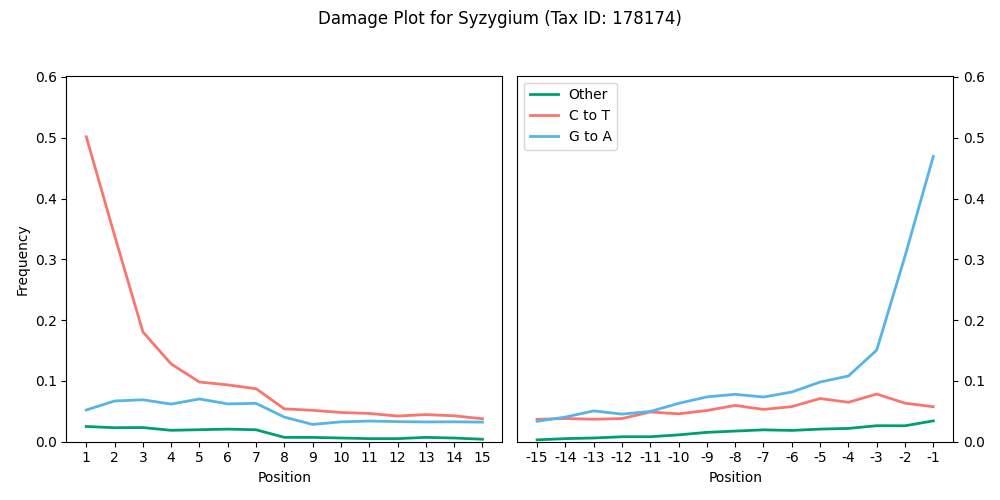

## <a name="quickstart"></a>Quick start

```
# install dependencies (tqdm is not strictly necessary)
pip install pysam hyperloglog matplotlib tqdm  

# install bamdam
git clone https://github.com/bdesanctis/bamdam.git
cd bamdam
chmod +x bamdam

# help
./bamdam -h
./bamdam shrink -h 

# run
./bamdam shrink --in_bam A.bam --in_lca A.lca --out_bam A2.bam --out_lca A2.lca --stranded ds  # (ds = double stranded library prep)
./bamdam compute --in_bam A2.bam --in_lca A2.lca --out_tsv A_tsv.txt --out_subs A_subs.txt --stranded ds
```

## Table of Contents
- [Quick start](#quickstart)
- [Description](#description)
- [Usage](#use)
  - [shrink](#shrink)
  - [compute](#compute)
  - [extract](#extract)
  - [plotdamage](#plotdamage)
  - [plotbaminfo](#plotbaminfo)
- [Tutorial](#tutorial)

## <a name="description"></a>Description

Bamdam is a post-mapping, post-least-common-ancestor toolkit for environmental DNA capture or shotgun sequencing data, used after reads have been mapped to a reference database and run through the least common ancestor algorithm [ngsLCA](https://github.com/miwipe/ngsLCA). The input to bamdam is a read-sorted bam (also required by ngsLCA) and the .lca file, the latter of which is output from ngsLCA. 

The main two functions are bamdam **shrink** and bamdam **compute**. When mapping against large reference databases, the output bam files will often be huge and contain mostly irrelevant alignments; the reads with the most alignments are usually those assigned to uninformative taxonomic nodes (e.g. "Viridiplantae:kingdom"). Bamdam shrink produces a much smaller bam (and associated lca file) which still contains all informative alignments. Bamdam compute then takes in a (shrunken) bam and lca file and produces a large table in tsv format with one row per taxonomic node, including authentication metrics such as k-mer duplicity and mean read complexity. Users can then set their own filtering thresholds to decide which taxa look like real taxa rather than contaminants. 

There are also some accessory functions. Bamdam **extract** extracts reads assigned to a specific taxonomic node from a bam file into another bam file for downstream analyses. Bamdam **plotdamage** uses the subs file, a secondary output from bamdam compute, to quickly produce a postmortem damage "smiley" plot for a specified taxonomic node in the case of ancient DNA. Bamdam **plotbaminfo** takes a bam file as input (e.g. from bamdam extract), and plots the mismatch and read length distributions. 

Bamdam is not particularly optimized for speed, and doesn't support threading (much of the effort is spent on bam file I/O). On the other hand, it reads and writes bams line-by-line, so it shouldn't need too much RAM. 

## <a name="use"></a>Usage

### <a name="shrink"></a>bamdam shrink

Input: Read-sorted bam file and associated lca file. Output: Smaller read-sorted bam file and associated lca file.

```
usage: bamdam shrink [-h] --in_lca IN_LCA --in_bam IN_BAM --out_lca OUT_LCA --out_bam OUT_BAM --stranded STRANDED [--options]

options:
  -h, --help            show this help message and exit
  --in_lca IN_LCA       Path to the input LCA file (required)
  --in_bam IN_BAM       Path to the input (read-sorted) BAM file (required)
  --out_lca OUT_LCA     Path to the short output LCA file (required)
  --out_bam OUT_BAM     Path to the short output BAM file (required)
  --stranded STRANDED   Either ss for single stranded or ds for double stranded (required)
  --mincount MINCOUNT   Minimum read count to keep a node (default: 5)
  --upto UPTO           Keep nodes up to and including this tax threshold; use root to disable (default: family)
  --minsim MINSIM       Minimum similarity to reference to keep an alignment (default: 0.9)
  --exclude_keywords EXCLUDE_KEYWORDS [EXCLUDE_KEYWORDS ...]
                        Keyword(s) to exclude when filtering (default: none)
  --exclude_keyword_file EXCLUDE_KEYWORD_FILE
                        File of keywords to exclude when filtering, one per line (default: none)
  --annotate_pmd        Annotate output bam file with PMD tags (default: not set)
```

Bamdam shrink will first subset your lca file to include only nodes which: ((are at or below your tax threshold) AND which meet your minimum read count), OR (are below a node which meets the former criteria). You may optionally give it a list or file of tax identifiers to exclude (e.g., taxa identified in your control samples). For exclusions, you can give it tax IDs (e.g. 4919) or full tax strings (e.g. 4919:Homo sapiens:species). It will only exclude reads assigned to exactly those nodes you give it, not those above or below. You can also filter the input lca file yourself beforehand, as long as the original order and format is preserved. For example, you may only be interested in eukaryotes, and so wish to do something like 

```grep "Eukaryot" A.lca > A_onlyeukaryots.lca```

before running bamdam. 

Once the new lca file is written, bamdam shrink will subset the bam file to include only reads which appear in the newly shortened LCA file, and only alignments of those reads which meet the minimum similarity cutoff. 

Bamdam shrink will also optionally annotate the new bam file with PMD scores as in PMDTools (in the DS:Z field) (--annotate_pmd), but beware PMD score annotation can be slow for large bam files. Please note that as of the time of writing, the original PMDTools has a serious bug in single-stranded mode, so please use bamdam shrink instead if you want to annotate single-stranded data with PMD scores.

### <a name="compute"></a>bamdam compute

Input: Read-sorted bam and associated lca file (both from bamdam shrink output). Output: Tsv file and subs file.

```
usage: bamdam compute [-h] --in_bam IN_BAM --in_lca IN_LCA --out_tsv OUT_TSV --out_subs OUT_SUBS --stranded STRANDED [--options]

options:
  -h, --help            show this help message and exit
  --in_bam IN_BAM       Path to the BAM file (required)
  --in_lca IN_LCA       Path to the LCA file (required)
  --out_tsv OUT_TSV Path to the output tsv file (required)
  --out_subs OUT_SUBS   Path to the output subs file (required)
  --stranded STRANDED   Either ss for single stranded or ds for double stranded (required)
  --k K                 Value of k for per-node counts of unique k-mers and duplicity (default: 29)
  --upto UPTO           Keep nodes up to and including this tax threshold; use root to disable (default: family)
```

Full list of the output tsv columns:

- **TaxNodeID**: The tax node ID from the lca file.
- **TaxName**: The tax name from the lca file.
- **TotalReads**: The number of reads assigned to that node or underneath.
- **Duplicity**: The average number of times a k-mer has been seen, where the k-mers are from reads assigned to that node or underneath. Should be close to 1 unless coverage is high.
- **MeanDust**: The average DUST score for reads assigned to that node or underneath.
- **Damage+1**: The actual proportion of reads assigned to that node or underneath where every alignment of that read had a C->T on the 5' (+1) position.
- **Damage-1**: The actual proportion of reads assigned to that node or underneath where every alignment of that read had a C->T if single stranded, or a G->A if double stranded, on the 3' (-1) position.
- **MeanLength**: The mean length of the reads assigned to that node or underneath.
- **ANI**: Average nucleotide identity of the reads assigned to that node or underneath. 
- **AvgReadGC**: Average GC content of the reads assigned to that node or underneath.
- **AvgRefGC**: Average GC content of the reconstructed reference genomic intervals with mapped reads assigned to that node or underneath.
- **UniqueKmers**: The number of unique k-mers in the reads assigned to that node or underneath.
- **TotalAlignments**: Sum of the number of alignments for all the reads assigned to that node or underneath.
- **taxpath**: The full taxonomic path from the lca file.

If the input bam file was annotated with PMD scores, the tsv file will also contain columns **PMDSOver2** and **PMDSOver4**, indicating the proportion of PMD scores over 2 and 4 respectively. PMD scores are from [Skoglund et al. 2014](https://doi.org/10.1073/pnas.131893411). 

In all cases unless otherwise specified, each read (not each alignment) is weighted equally.

Bamdam compute aggregates statistics up the taxonomy and outputs rows for all taxonomic nodes up to the "upto" flag, so perhaps counterintuitively, results from bamdam compute after excluding higher-level taxonomic nodes in bamdam shrink may still contain rows for those nodes if there were reads assigned to nodes underneath those excluded which were not themselves excluded.

### <a name="extract"></a>bamdam extract

Extracts reads assigned to a specific taxonomic node or underneath from a bam file. Output is another bam file. Accepts tax IDs or full tax strings. Subsetting the header is recommended but slower, so not set by default. Optionally, you can only include alignments to the most-hit reference genome to obtain a single-reference-genome bam (this requires both --only_top_ref and --subset_header).

```
usage: bamdam extract [-h] --in_bam IN_BAM --in_lca IN_LCA --out_bam OUT_BAM --keyword KEYWORD [--subset_header] [--only_top_ref]

options:
  -h, --help         show this help message and exit
  --in_bam IN_BAM    Path to the BAM file (required)
  --in_lca IN_LCA    Path to the LCA file (required)
  --out_bam OUT_BAM  Path to the filtered BAM file (required)
  --keyword KEYWORD  Keyword or phrase to filter for, e.g. a taxonomic node ID (required)
  --subset_header    Subset the header to only relevant references (default: not set)
  --only_top_ref     Only keep alignments to the most-hit reference (default: not set)
```

### <a name="plotdamage"></a>bamdam plotdamage

Plots a postmortem damage "smiley" plot using the subs file produced from bamdam compute. Fast. Accepts tax IDs only. Produces png or pdf.

```
./bamdam plotdamage --in_subs IN_SUBS --tax TAX --outplot OUTPLOT
```

Example output:
<p align="center">


### <a name="plotbaminfo"></a>bamdam plotbaminfo

Plots mismatch and read length distributions. Mostly intended to be used after bamdam extract. Not very fast for large input bam. Produces png or pdf.

```
./bamdam plotbaminfo --in_bam IN_BAM --outplot OUTPLOT
```

Example output:
<p align="center">

</p>

## <a name="tutorial"></a>Tutorial

You can follow this tutorial on a laptop. We will analyze a small portion of an unpublished ancient metagenomic DNA sample from China, prepared with double stranded library prep. The bam file has previously been query-sorted, subsetted, and run through ngsLCA. It may take a few minutes to download files. 
```
wget https://sid.erda.dk/share_redirect/CN4BpEwyRr/CGG3_015421.lca
wget https://sid.erda.dk/share_redirect/CN4BpEwyRr/CGG3_015421.sub_sorted.bam
```
Running the main bamdam commands may take another few minutes.
```
./bamdam shrink --in_bam CGG3_015421.sub_sorted.bam --in_lca CGG3_015421.lca --out_bam CGG3.small.bam --out_lca CGG3.small.lca --stranded ds
./bamdam compute --in_bam CGG3.small.bam --in_lca CGG3.small.lca --out_tsv CGG3.tsv --out_subs CGG3.subs.txt --stranded ds
```
Now you can look at your output files and see what's in there. The tsv is ordered by read count.
```
head CGG3.tsv
```
Looks like the top hit is the plant subfamily Myrtoideae, with tax ID 1699513. This looks real and ancient: k-mer duplicity close to 1, sufficiently low mean DUST score, high amounts of damage on both ends, short read length, etc. Next let's plot damage for this taxa.
```
./bamdam plotdamage --in_subs CGG3.subs.txt --tax 1699513 --outplot CGG3_Myrtoidae_damageplot.png
```
Now let's plot the mismatch and read length distributions for all Myrtoideae reads. 
```
./bamdam extract --in_bam CGG3.small.bam --in_lca CGG3.small.lca --out_bam CGG3.Myrtoideae.bam --keyword 1699513
./bamdam plotbaminfo --in_bam CGG3.Myrtoideae.bam --outplot CGG3_Myrtoideae_baminfo.png
```
Lastly, we might want to investigate reference-specific properties like evenness of coverage. Let's extract only those Myrtoidae reads which hit the most common Myrtoidae reference. This might take a minute.
```
./bamdam extract --in_bam CGG3.small.bam --in_lca CGG3.small.lca --out_bam CGG3.MyrtoideaeTopRef.bam --keyword 1699513 --subset_header --only_top_ref
```
The command-line output tells you the most common reference genome, NW_026607485.1. As an example of a potential downstream step, let's download this reference, coordinate-sort the bam, and make a samtools command-line reference-specific coverage plot. This requires samtools.
```
wget "https://eutils.ncbi.nlm.nih.gov/entrez/eutils/efetch.fcgi?db=nucleotide&id=NW_026607485.1&rettype=fasta&retmode=text" -O NW_026607485.1.fasta
samtools sort CGG3.MyrtoideaeTopRef.bam > CGG3.MyrtoideaeTopRefSorted.bam
samtools coverage CGG3.MyrtoideaeTopRefSorted.bam -m
```

## License
This project is licensed under the MIT License - see the LICENSE file for details.

Bamdam was written by Bianca De Sanctis in 2024. For assistance please contact bddesanctis@gmail.com.
